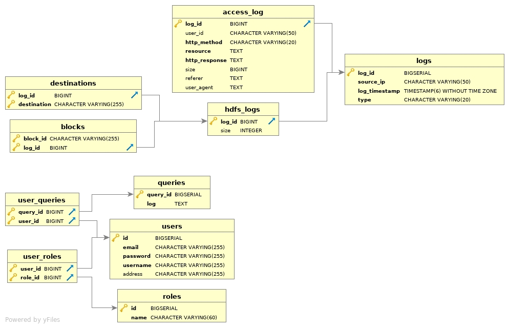

# ServerLogs
Project for Post-Graduate class Database Management Systems

# Authors
- [Papadopoulos Christos](https://github.com/Christosc96)
- [Papamichalopoulos Marios](https://github.com/PapamichMarios)

# Tools Used
- Spring Boot 
- React
- PostgresSQL 11.6
- IntelliJ IDEA
- Webpack
- Various NPM dependencies (package.json)

# How to run
- Import project as Maven project in IntelliJ
- Extract the ```logs.tar.gz``` from the ```logs``` directory
- Use the python script ```csv_parser.py``` within the directory to parse the logs to CSV format.
- Import CSV files using pgAdmin 4.
- Run in the project folder the commands: 

```
sudo npm install
sudo npm run build
```

- Start from IntelliJ and you should be able to browse it from:
```
https://localhost:8080/
```

# Final Schema



The main relation in our database is the logs relation. It contains all the information present in every type of log and
its primary key is an auto-incremented value which acts as the id for each log. This attribute is also referenced by 
every other relation in our schema and it allows us to have the database in second normal form (2NF) since there are no values dependent
on a subset of any candidate key (the only candidate key here is the minimal superkey log_id). As for 3NF normalization we allowed some 
tables to remain non normalized (such as access table where some fields might be dependent on other non-candidate key fields) to speed 
up queries.

We also experimented with various indexes and index types. The most efficient index is a b-tree on the timestamp column on log_id as
it speeds up ranged queries like function1 by quite a lot.
This can be seen by the times displayed below:


Some other indices like on http methods for the last functions did not give us any significant performance gains. Function5 was better 
with index on referer:


# Functions

Their implementation can be seen through the file schema:

```src/main/postgresql/log_db.sql```

# Sample Snapshots

- Homepage


- Sign Up


- Log In


- Insert any type of Log


- Execute server procedures


# Github Link
[ServerLogs](https://github.com/PapamichMarios/ServerLogs)
